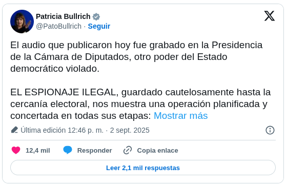
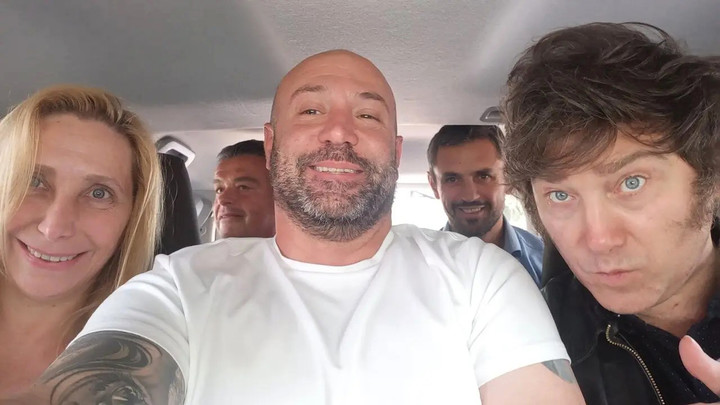
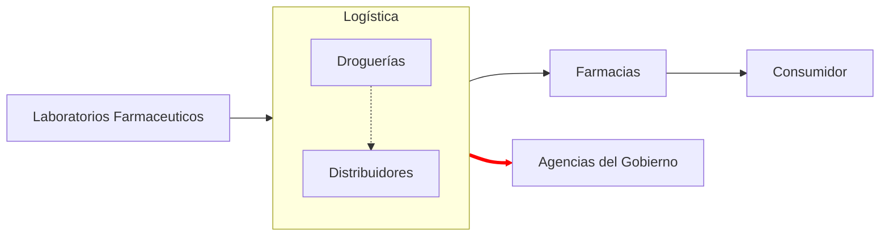
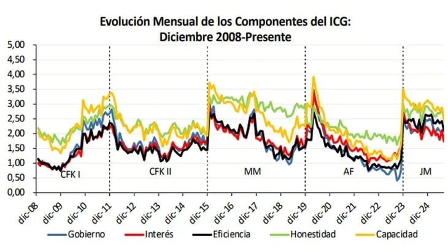

# Crisis Política en Argentina

> [Notícia](https://elpais.com/argentina/2025-09-03/milei-se-abraza-a-la-teoria-del-complot-para-proteger-a-su-hermana-de-las-acusaciones-de-corrupcion.html)

    El Gobierno asegura que la difusión de grabaciones ilegales de Karina Milei tiene como objetivo
    desestabilizarlo en la víspera de las elecciones legislativas

## Resumen

En Argentina, el gobierno del presidente `Javier Milei` enfrenta una grave crisis política por la difusión de audios que
involucran a su hermana, `Karina Milei`, y a varios funcionarios de confianza en un presunto caso de corrupción en la
compra de medicamentos.

Los primeros audios fueron atribuidos a `Diego Spagnuolo`, director de la Agencia Nacional de Discapacidad y amigo
personal del presidente. En las grabaciones, se mencionan sobornos y negociaciones ilegales con la empresa farmacéutica
`Suizo Argentina`.

La Justicia investiga posibles delitos de administración fraudulenta, cohecho y estafa.

**Respuesta del Gobierno**:

- Negó las acusaciones, calificándolas de ("burdas operaciones difamatorias")
- Desplazó a Spagnuolo de su cargo
- Denunció un complot internacional, hecho por `periodistas espías` (servicios secretos rusos y venezolanos)
- Consiguió que un juez prohibiera la difusión de nuevos audios
- Milei compartió un comunicado de la empresa acusada defendiendo su inocencia

Sin embargo, estas medidas generaron críticas de la oposición y de la prensa, que acusan al presidente de censura y de
no responder al contenido de los audios.

---

Mientras el Gobierno quitaba cientos de pensiones por invalidez, la voz del responsable del área denunciando sobornos.

Las medidas de combate a la denuncia generaron todo tipo de críticas:

## Quién son los acusados principales

### Diego Spagnuolo

Abogado, amigo personal de Milei y director de la ANDIS.

Registra más ingresos a la Casa Rosada y la residencia oficial del presidente que cualquiera de los ministros de más
rango.

### Karina Mieli

Hermana y la persona más poderosa de la gestión libertaria.

Apodada por Milei de `El jefe`, ocupa el cargo de Secretaria General de la Presidencia, cargo creado justo para ella.

### Martin y Eduardo "Lule" Menem

Lule es subsecretario de Gestión Institucional y hermano Carlos Menem, quien fuera presidente de la Nación entre 1989
y 1999.

Martin es diputado nacional y presidente de la Cámara baja y no de los principales armadores de La Libertad Avanza en
todo el país. Martin es hijo de Lule.

## La logística de lo presunto soborno

La posible logística de la cobra de coima se basa en la estructura de distribución de medicamentos en Argentina.

## El contexto

La crisis también hace que el presidente pierda apoyo entre sus propios votantes, ya que golpea directamente su
principal bandera de lucha: la guerra contra “la casta” y los “chorros kirchneristas”.

- víspera de las elecciones legislativas nacionales y de la provincia de Buenos aires
- pesquisas apuntan la Libertad Avanza como gran favorita
- presidente con mayor confianza media desde cuando empezaron a medirla (Noviembre 2001)
- cierre del instituto Perón
- salida del consejo de derechos humanos
- cortes de pensiones por invalidez (entre otros departamentos de justicia social)
- anuncio de no comprar los derechos de transmisión de la copa (por primer vez en 50 años) - 7M dólares
- campaña política violenta con ataque de objetos a las caravanas políticas de Milei
- queda significativa en la confianza (13.5%)
- renuncia 3 de 5 académicos del instituto Misses después que premiaron del mandatario

## Vocabulario

- `pergeñar`

> disponer o ejecutar algo con más o menos habilidad

- `mojones`

> Piedra o señal que indica las distancias en un camino o en una carretera

## Otras Referencias

https://www.clarin.com/sociedad/escandalo-coimas-andis-rol-droguerias-distribucion-medicamentos_0_OnYOnAHbCa.html
https://www.lanacion.com.ar/politica/que-dicen-los-nuevos-audios-de-diego-spagnuolo-nid27082025/
