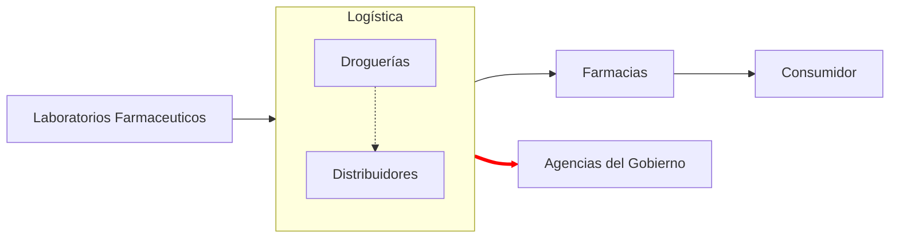

# Crisis Política en Argentina

> [Notícia](https://elpais.com/argentina/2025-09-03/milei-se-abraza-a-la-teoria-del-complot-para-proteger-a-su-hermana-de-las-acusaciones-de-corrupcion.html)

    El Gobierno asegura que la difusión de grabaciones ilegales de Karina Milei tiene como objetivo
    desestabilizarlo en la víspera de las elecciones legislativas

## Résumen

El Gobierno llevaba días resistiendo el impacto de otros audios en los que el director de la Agencia Nacional de
Discapacidad (Andis), `Diego Spagnuolo`, involucra a `Karina Milei` y dos de sus principales asesores, los primos
`Martín` y `Eduardo Lule Menem`, y los ministros `Federico Sturzenegger` (Desregulación) y `Sandra Pettovello` (Capital
Humano) en una trama de corrupción en la compra de medicamentos para su cartera.

La justicia está investigando a Spagnuolo y a los ejecutivos de la distribuidora de medicamentos `Suizo Argentina`,
mencionada en los audios, por los delitos de administración fraudulenta, estafa, cohecho y negociaciones incompatibles
con la función pública.

Has ta ahora, las respuestas del gobierno fueron:

- nego las acusaciones ("burdas operaciones difamatorias")
- desplazar a Spagnuolo de su cargo como medida preventiva
- se decir víctima de un complot internacional, hecho por `periodistas espías` (servicios secretos rusos y venezolanos)
- conseguir que un juez prohibiese la difusión de nuevos audios
- Milei compartió un comunicado oficial de la droguería Suiza Argentina en sus redes sociales

Mientras el Gobierno quitaba cientos de pensiones por invalidez, la voz del responsable del área denunciando sobornos.

La denuncia es relevante por su principal bandera de lucha “contra la casta” y los “chorros [ladrones] kirchneristas”.

Las medidas de combate a la denuncia generaron todo tipo de críticas:

- censura previa
- ataque a la libertad de prensa
- sin respuestas a los contenidos de los audios
- fallas en el servicio de inteligencia argentino
-
- la denuncia se centra en el espionaje a Karina, pero nada dice de los audios de Spagnuolo, tan cuestionables en su
  origen como aquellos, pero mucho más peligrosos en su contenido

## Quién son los acusados

### Diego Spagnuolo

Abogado y amigo personal de Milei, registra más ingresos a la Casa Rosada y la residencia oficial del presidente que
cualquiera de los ministros de más rango.

### Karina Mieli

Hermana y la persona más poderosa de la gestión libertaria y sostén anímico del presidente.

Llamada por Milei de `El jefe` ocupa el cargo de Secretaria General de la Presidencia, cargo creado para ella.

### Martin y Eduardo "Lule" Menem

Lule es subsecretario de Gestión Institucional y hermano Carlos Menem quien fuera presidente de la Nación entre 1989
y 1999.

Martin es diputado nacional y presidente de la Cámara baja y no de los principales armadores de La Libertad Avanza en
todo el país. Martin es hijo de Lule.

## La logística de lo presunto soborno

La posible logística de la cobra de coima se basa en la estructura de distribución de medicamentos en Argentina.

## El contexto

- víspera de las elecciones legislativas nacionales y de la provincia de Buenos aires
- pesquisas apuntan la Libertad Avanza como gran favorita
- presidente con mayor confianza media desde cuando empezaron a medirla (Noviembre 2001)
- cierre del instituto Perón
- salida del consejo de derechos humanos
- cortes de pensiones por invalidez (entre otros departamentos de justicia social)
- anuncio de no comprar los derechos de transmisión de la copa (por primer vez en 50 años) - 7M dólares
- campaña política violenta con ataque de objetos a las caravanas políticas de Milei
- queda significativa en la confianza (13.5%)
- renuncia 3 de 5 académicos del instituto Misses después que premiaron del mandatario

## Vocabulario

- `pergeñar`

> disponer o ejecutar algo con más o menos habilidad

- `mojones`

> Piedra o señal que indica las distancias en un camino o en una carretera

## Otras Referencias

https://www.clarin.com/sociedad/escandalo-coimas-andis-rol-droguerias-distribucion-medicamentos_0_OnYOnAHbCa.html
https://www.lanacion.com.ar/politica/que-dicen-los-nuevos-audios-de-diego-spagnuolo-nid27082025/
